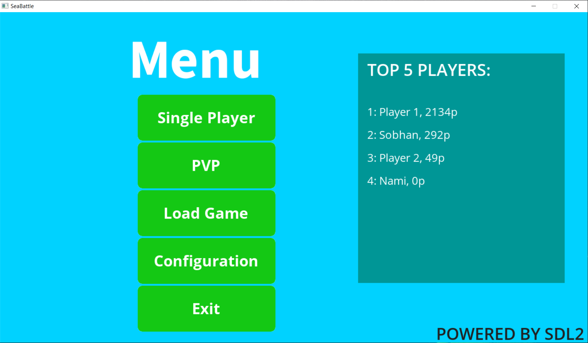
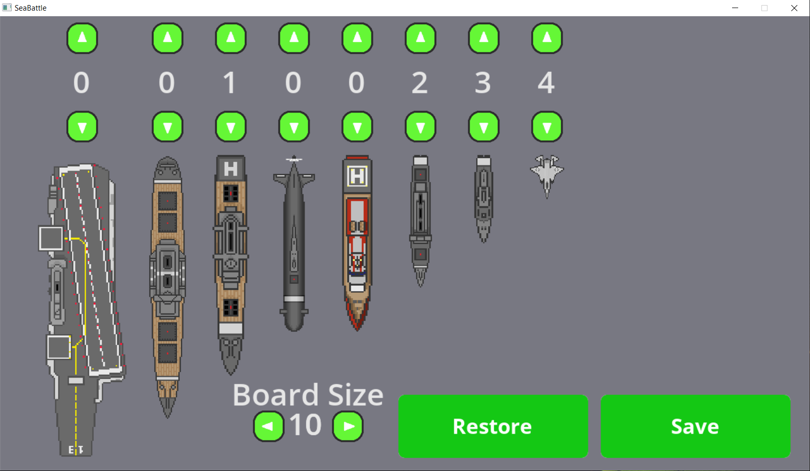

# Sea Battle using SDL2
Sea battle is a two player game where each player has secret formation of battleships and the other player should try and bomb them by calling their locations and getting the feedback the weather each shot hit a ship or the water. Players would also be informed when they get a full ship.

This game is implemented both in PvP and PvC modes. For the PvC mode a simple CSP agent is realized which is both used to initially set computer's board and subsequently is used to estimate where ships could have been placed in player's board in order to aim the rockets more efficiently. 

In addition to Board size, Types and number of each battleship type can be specified to make the game more engaging.

When a new game is started player is allowed to set their board. They can also use to provided function that fills the board automatically

After both boards are set, players (or player and computer) each shoot their rockets in turn. If a rocket hits a ship the player (or computer) is allowed to shoot another rocket.
If game is in PvC mode, the player is allowed to watch what moves the computer makes which explains why it has scored.

***Player Turn:***

***Computer Turn:***

The players can also exit in the middle of the game and the session can be saved.

## Requirements
This game requires resources from SDL2 Library. The following packages are needed:
- SDL2 base (tested version 2.0.14)
- SDL2 image (tested version 2.0.5)
- SDL2 ttf (tested version 2.0.15)

## To Compile
To compile the provided code, the lib directories from all three packages should be combined into a single lib directory and placed at the root of the project.   

## To Run
The provided <a href="bin/SeaBattle.exe">executable</a> can be run in the given file structure, and it's not a portable standalone file. The provided DLLs and the <a href="/resources">resources</a> directory are also required.

## Assets
All the assets used in this game are licensed under free creative commons license.